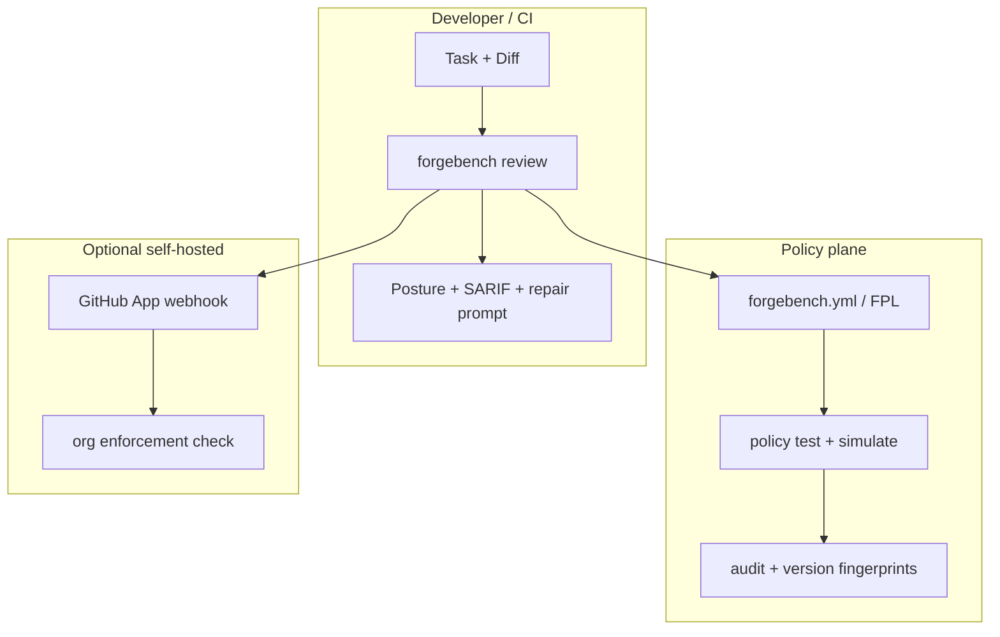

# ForgeBench — Marketing Home (EO-013 Go-to-Market)

Technical positioning for forgebench.dev. **Merge-risk governance for AI-generated code** — local-first, evidence-backed, honest about limits.

## Hero

**Would a serious engineer merge this AI-generated diff?**

ForgeBench answers that question before code reaches `main`. Not agent task completion. Not vibe scores. **Cited merge posture** with a repair loop your agents can act on.

[Start free](#quickstart) · [Pricing](#pricing) · [Early Access](#early-access) · [Security pack](#security) · [Roadmap](../ROADMAP.md)

## Why teams adopt ForgeBench

| Problem | ForgeBench response |
|---------|---------------------|
| Agents ship broad diffs fast | Posture: `BLOCK` / `REVIEW` / `LOW_CONCERN` with evidence |
| Generic linters miss task drift | Scope Auditor + guardrails policy (FPL v1) |
| "LGTM" on AI code | Merge Risk Benchmark — 47+ golden cases + real PR outcomes |
| Policy sprawl in monorepos | Org layers + self-hosted GitHub App enforcement |
| Audit asks "how do you gate AI merges?" | SOC2-style control matrix + policy audit JSONL |

## Architecture (local-first)



Deterministic failures are never downgraded. Optional LLM/Grok layers are advisory.

## Quickstart

**Solo developer**

```bash
pip install forgebench   # or: pipx install forgebench
forgebench quickstart
forgebench doctor --checklist
forgebench presets install python
forgebench share-report --out forgebench-output
```

**Engineering team**

```bash
forgebench team init
forgebench license activate FB-TEAM-...
forgebench review-pr https://github.com/org/repo/pull/42 --guardrails .github/forgebench.yml --checkout-pr --run-checks
forgebench policy test --tests examples/policy_tests
```

Install: `forgebench install` · [Installation guide](https://forgebench.dev/docs/installation/) · [VS Code Marketplace](https://marketplace.visualstudio.com/items?itemName=caissonhq.forgebench) · Presets: [presets-gallery.md](presets-gallery.md) · Design partners: [design-partner.md](design-partner.md)

## Pricing

| Tier | Price | Highlights |
|------|-------|------------|
| **Free** | $0 | Full core review, IDE extensions, GitHub Action |
| **Team** | $29/dev/mo (EA) | License keys, `init --enterprise`, analytics, usage reports |
| **Enterprise** | Custom | Policy serve, GitHub App serve, Grok quotas, SOC2 pack |

```bash
forgebench license activate FB-TEAM-...
forgebench license status
forgebench analytics dashboard
```

Details: [pricing.md](pricing.md) · [sales/one-pager.md](sales/one-pager.md)

## Early Access

Team and Enterprise packages add **adoption infrastructure**, not hosted code review:

- **License seat management** (`forgebench license`)
- **Product analytics dashboard** (opt-in, distinct from review telemetry)
- Production **VS Code** and **JetBrains** extensions
- **Self-hosted GitHub App** manifest + org policy enforcement
- **SOC2-style** security documentation for procurement
- Customer success kit: onboarding playbook, SLA template, support process

Details: [early-access.md](early-access.md) · [customer-success/onboarding-playbook.md](customer-success/onboarding-playbook.md)

## Integrations

| Surface | Status |
|---------|--------|
| CLI + MCP + Cursor | GA (beta) |
| GitHub Action | GA |
| VS Code extension | EA v1.1 — Marketplace submission ready |
| JetBrains plugin | EA v1.1 |
| License + analytics | Team/Enterprise |
| Self-hosted GitHub App | EA kit |
| FPL + policy tests | GA |
| GitLab / CircleCI / Jenkins | Recipes |

## Security

- [Trust model](trust-model.md)
- [SOC 2 readiness](security/soc2-readiness.md)
- [Controls matrix](security/controls-matrix.md)
- [Audit prep checklist](security/audit-prep-checklist.md)

## Community

- [Contribution program](contribution-program.md)
- [CONTRIBUTING.md](../CONTRIBUTING.md)
- Merge Risk Benchmark: [merge-risk-benchmark.md](merge-risk-benchmark.md)

## Footer

ForgeBench does not prove code is safe. It highlights merge risk before AI-generated code reaches main.