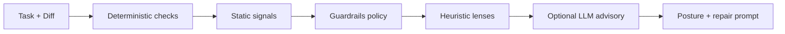

# ForgeBench — Marketing Home (EO-006 refresh)

Use this page copy for the public site (Lovable / forgebench.dev). Local-first. Evidence-backed. No hosted SaaS claims.

## Hero

**ForgeBench reviews AI-generated diffs before they hit main.**

SWE-Bench asks whether an agent solved a task. ForgeBench asks whether a serious engineer would merge the diff.

[Get started](#quickstart) · [See a sample report](#sample-reports) · [Public roadmap](../ROADMAP.md)

## Value pillars

1. **Merge posture, not vibes** — `BLOCK`, `REVIEW`, or `LOW_CONCERN` with cited evidence
2. **Repo-aware guardrails** — shared `forgebench.yml`, org policy layers, monorepo scope filters
3. **Agent loop friendly** — Markdown report, JSON, SARIF, repair prompt for Cursor / Codex / Claude
4. **CI anywhere** — GitHub Actions, GitLab CI, CircleCI, Jenkins recipes
5. **Calibrated honesty** — Merge Risk Benchmark over 47+ golden cases; real anonymized dogfood reports

## How it works



Evidence hierarchy: deterministic → static → guardrails → lenses → optional LLM. Deterministic failures are never downgraded.

## Quickstart

```bash
pip install forgebench
forgebench doctor
forgebench review-pr https://github.com/org/repo/pull/1
forgebench init --repo . --out forgebench.yml
```

## Team & Enterprise (local-first)

- Layer org policy with `extends`, `include`, or `FORGEBENCH_ORG_POLICY`
- Export a **policy dashboard skeleton**: `forgebench dashboard`
- Validate shared policy in CI: `forgebench validate --strict`

Details: [team-enterprise.md](team-enterprise.md)

## Integrations

| Surface | Link |
|---------|------|
| GitHub Action | [action/README.md](../action/README.md) |
| GitLab / CircleCI / Jenkins | [ci-integrations.md](ci-integrations.md) |
| Cursor + MCP | [cursor-integration.md](cursor-integration.md) |
| VS Code / JetBrains scaffolds | [ide-integrations.md](ide-integrations.md) |

## Review lenses (Phase 1)

- Scope Auditor
- Test Skeptic (+ optional LLM v2 when triggered)
- Contract Keeper
- Product / Guardrail Reviewer
- Dependency Watcher v0
- Repo Convention Reviewer
- Security Reviewer v0
- Regression Hunter (narrow Phase 2)

Lenses route attention. They do not approve merges or assign numeric scores.

## Sample reports

- Synthetic first-run examples: [examples/sample_report](../examples/sample_report)
- Real anonymized dogfood (EO-002): [examples/real_reports](../examples/real_reports)
- Merge Risk Benchmark: [merge-risk-benchmark.md](merge-risk-benchmark.md)

## Public beta

Structured local feedback export for dogfood teams. See [beta-launch.md](beta-launch.md).

## Community

- [ROADMAP.md](../ROADMAP.md) — what ships next
- [CONTRIBUTING.md](../CONTRIBUTING.md) — golden cases, PRs, calibration

## Footer disclaimer

ForgeBench does not prove code is safe. It highlights merge risk before AI-generated code reaches main.